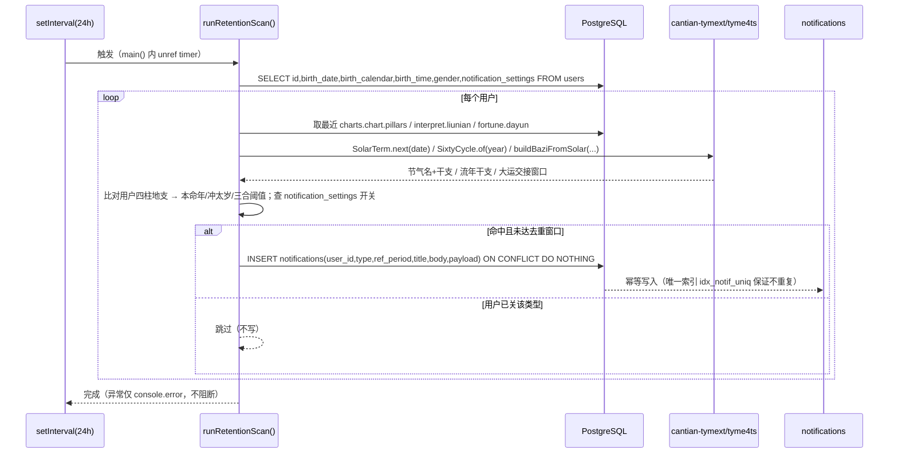
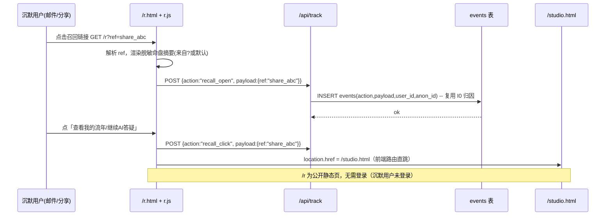
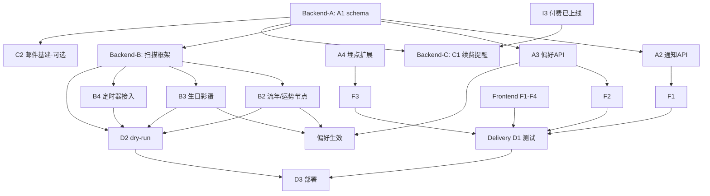

# 辰箓 I2「留存」· 系统架构设计 + 任务分解

> 架构师：高见远（Bob） · 2026-09-07 · 类型：增量架构设计 + 任务分解（不写实现代码）
> 依据：`docs/prd-i2-retention-2026-09-07.md`（已拍板 4 项决策）、`server.js`、`lib/db.js`、`lib/auth.js`、`lib/schema.sql`、`node_modules/cantian-tymext`（含 tyme4ts）
> 技术约束：Node v22（`--experimental-strip-types`，无框架）+ 纯静态前端 + PostgreSQL（**零新依赖**）；生产端口 8787，systemd `bazi-system.service` 托管。

---

## 0. 事实基线（实读结论，避免凭空假设）

| 核查项 | 结论 | 出处 |
|---|---|---|
| `notifications` 表 | **不存在**，需新建 | Grep 全仓无 `CREATE TABLE ... notifications` |
| 站内信相关代码 | 无（仅 `pg` 的 LISTEN/NOTIFY 噪声命中，非业务） | Grep |
| SMTP / nodemailer | **从未实现**。`server.js:988` 仅 `!process.env.SMTP_HOST` 判断"是否回传重置 token 给前端"，全仓无发信逻辑 | `server.js:982-994`、`lib/auth.js:97-108` |
| 历法依赖 | `cantian-tymext@0.0.26` 已装；其 `index.js` 为 `export * from 'tyme4ts'`，**tyme4ts 全套可用** | `node_modules/cantian-tymext/dist/index.js`、`package-lock.json` |
| 节气/流年/干支 API | `tyme4ts` 含 `SolarTerm`、`SixtyCycle`、`HeavenStem`、`EarthBranch`、`LunarDay`、`SolarDay`；无独立 `LiuNian`/`MingGong`/`DaYun` 类 | `node_modules/tyme4ts/dist/lib` |
| 已存八字 | `users.birth_date`(VARCHAR) / `birth_calendar`(0/1/2) / `birth_time`(VARCHAR) / `gender`；最近命盘在 `charts.chart JSONB`（含 `pillars[年,月,日,时]`、`dayMaster`、`natal`） | `lib/schema.sql:3-18`、`server.js:285-295` |
| 大运/流年数据 | `charts.fortune JSONB`（含 `dayun` 大运序列）、`charts.interpret JSONB`（含 `liunian`、`currentDayun`） | `server.js:289-294` |
| 付费授权 | `entitlement_grants`（grantee_type/grantee_id/expires_at），`/api/auth/me` 已回传 `entitlementExpiresAt` | `lib/schema.sql:216-225`、`server.js:824-837` |
| 埋点/归因 | `events` 表 + `INSERT INTO events(action,payload,user_id,anon_id)`；`/api/track` 白名单 `TRACK_ACTIONS`（`server.js:1016`） | `server.js:1032-1044` |
| 调度器先例 | `main()` 已用 `setInterval` 调 `tools/backup-daily.mjs`（进程内轻量定时） | `server.js:1207-1221` |
| 前端结构 | `public/*.html`+`*.js` 纯静态；页面以 `app.js`/`index.js`/`studio.js` 各自独立；`pricing.html` 即结缘堂页；无 `/member`、无 `/r`、无通知铃铛 | `public/` 目录 |
| 分享卡视觉(I4) | 本仓 `public/` 未检索到分享卡页面 → **复用视觉语言改为引用 `style.css` 设计令牌**（I4 视觉源待确认） | Grep `public/` |

---

## 1. 实现方案 + 框架选型

### 1.1 技术栈（沿用，零新依赖）

- **后端**：Node v22 单体 `server.js` + `lib/*.js`（ESM，`--experimental-strip-types` 仅用于既有 `.ts` 辅助文件，本次新增逻辑一律 `.js`）。DB 复用 `lib/db.js` 的 `pool`/`query`/`initSchema`，PostgreSQL。
- **前端**：纯静态零构建 `public/*.html` + `public/*.js`，直接复用既有 `style.css` 设计语言，无打包器。
- **历法**：复用既有 `cantian-tymext@0.0.26`（透传 tyme4ts）→ `SolarTerm`/`SixtyCycle`/`buildBaziFromSolar`/`HeavenStem`/`EarthBranch` 等。
- **新增依赖 = 无**（R6 邮件若落地需 `nodemailer`，列为可选新增，本阶段可降级，见 §6）。

### 1.2 调度器选型（关键决策）

| 维度 | 方案 A：进程内 `setInterval` 每日扫（**推荐**） | 方案 B：OS crontab 独立 `.mjs` |
|---|---|---|
| 运维负担 | 零（不碰 systemd unit / crontab） | 需新增 crontab 条目或 systemd timer |
| 与现状一致性 | 高（复用 `main()` 已有 `backupTimer` 模式） | 另起进程，需独立 DB 连接与环境注入 |
| 低频适配 | ✅ 每日扫一次，仅做"阈值/节气临近"检查，成本极低（用户量小） | 过度工程 |
| 进程重启影响 | 重启后下一周期自然续扫，无遗漏风险（去重键保证幂等） | 同上 |
| fail-open | ✅ 异常仅 `console.error` 不阻断服务（与 `backupTimer` 一致） | 同 |

**推荐方案 A（进程内轻量扫描器）**，理由：
1. 产品为**低频命理娱乐**，留存钩子天然 15–365 天间隔，无实时性要求，每日一次扫足够；
2. Edward 硬约束"零运维 / 个人可维护"，方案 A 不引入任何部署侧改动（crontab/systemd timer 都要改生产环境，违反 rsync-only 部署）；
3. 与既有 `backupTimer` 模式一致，工程师可直接模仿，**降低实现风险**。

**落地形态（两用）**：核心扫描逻辑放 `lib/retention.js`（`export async function runRetentionScan()`）；`server.js` 的 `main()` 内新增 `setInterval(runRetentionScan, 24h).unref()`（**方案 A 默认**）；另提供 `tools/scheduler-retention.mjs` 仅 `import { runRetentionScan } from '../lib/retention.js'` 并调用，作为**可选** OS crontab 入口（若未来用户量上来需与主进程解耦时启用，不改默认行为）。

---

## 2. 文件列表（新增 / 修改，相对路径）

### 2.1 数据库（共享，由 Backend-A 落地）
- **`lib/schema.sql`**（**修改**）：新增 `notifications` 表 + 索引；`users` 表新增 `notification_settings JSONB` 列（默认全开）。幂等（`CREATE TABLE IF NOT EXISTS` + `ALTER TABLE ... ADD COLUMN IF NOT EXISTS`）。

### 2.2 后端 — Backend-A（站内信基础设施 + API）
- **`server.js`**（**修改**）：新增 4 个 handler 函数 + 在 `main()` 路由 switch 注册；新增 `TRACK_ACTIONS` 白名单项（`recall_open`/`recall_click`/`notification_open`）。
  - 新增函数：`handleNotificationsList`、`handleNotificationRead`、`handleNotificationReadAll`、`handleNotificationUnreadCount`、`handleNotificationSettingsGet`、`handleNotificationSettingsPut`。
- **`lib/auth.js`**（**不修改**，复用）：`getUserFromRequest`（通知接口需登录态）。
- **`lib/db.js`**（**不修改**，复用）：`query`/`pool`。

### 2.3 后端 — Backend-B（节律调度器 + 提醒生成）
- **`lib/retention.js`**（**新增**）：`runRetentionScan()`；内部 `scanSolarTerm()` / `scanLiuNian()` / `scanDestinyNode()` / `scanBirthday()`；写 `notifications`。导入 `cantian-tymext`（`SolarTerm`/`SixtyCycle`/`buildBaziFromSolar`/`HeavenStem`/`EarthBranch`）。
- **`tools/scheduler-retention.mjs`**（**新增**）：可选 OS crontab 入口，调用 `runRetentionScan()`。
- **`server.js`**（**修改**，与 A 同文件协同）：`main()` 内新增 `setInterval(runRetentionScan, 24h).unref()` + 启动 10 分钟后首跑一次（仿 `backupTimer`）。

### 2.4 前端（铃铛 / 设置页 / 召回落地页 / 续费提示）
- **`public/index.html`**（**修改**）：顶部导航新增铃铛图标 + 未读红点容器。
- **`public/index.js`**（**修改**）：铃铛渲染 + 拉取未读计数（`/api/notifications/unread-count`）+ 点击展开通知抽屉（调 `/api/notifications`、标已读）。
- **`public/studio.html` / `public/studio.js`**（**修改**）：同款铃铛组件（可抽公共 `public/bell.js`）。
- **`public/settings-notifications.html`**（**新增**）：4.1 提醒设置页（PRD 线框）。
- **`public/settings-notifications.js`**（**新增**）：读写 `/api/notifications/settings`。
- **`public/r.html`**（**新增**）：4.2 召回落地页 `/r?ref=...`，复用 `style.css` 设计令牌（I4 分享卡视觉源待确认，见 §8）。
- **`public/r.js`**（**新增**）：载入即 `/api/track{action:'recall_open',payload:{ref}}`；按钮"查看流年/继续AI答疑"→ `/studio.html` 并 track `recall_click`。
- **`public/pricing.html` / `public/pricing.js`**（**修改**）：4.3 权益中心续费提示 Banner——读 `/api/auth/me` 的 `entitlementExpiresAt`，距到期 ≤7 天显示"将于 N 天后到期，续费可连续持有"。（**无新 API**，R5 通知生成属 Backend-C。）

### 2.5 后端 — Backend-C（邮件召回 + 续费提醒，可后置）
- **`lib/mailer.js`**（**新增，可选依赖**）：封装 SMTP（若 `process.env.SMTP_HOST` 存在且 `nodemailer` 已装）。本阶段**默认不启用**：`SMTP_HOST` 未配置时所有邮件路径走 no-op 并记日志。
- **`lib/retention.js`**（**修改**，后置追加）：`scanRenewalReminder()`（基于 `entitlement_grants.expires_at` 提前 N 天写 `notifications`，type=`renewal_reminder`）。
- **`tools/mail-recall.mjs`**（**新增，可选**）：R6 邮件召回批处理（依赖 I3 已上线 + 邮件基建）。

### 2.6 交付（Delivery 工程师）
- 复用既有 `tools/deploy.mjs`（rsync）、`tools/preflight.mjs`、`tools/qa-gates.mjs`；新增回归用例于 `tools/test-notifications.mjs`（API 契约测试）。

---

## 3. 数据结构和接口

### 3.1 ER / 类图（Mermaid）

```mermaid
erDiagram
    users {
        BIGINT id PK
        VARCHAR username
        VARCHAR email
        VARCHAR birth_date
        SMALLINT birth_calendar
        VARCHAR birth_time
        SMALLINT gender
        VARCHAR day_stem
        VARCHAR month_zhi
        JSONB notification_settings
    }
    charts {
        BIGSERIAL id PK
        BIGINT user_id FK
        JSONB chart
        JSONB interpret
        JSONB fortune
    }
    notifications {
        BIGSERIAL id PK
        BIGINT user_id FK
        VARCHAR type
        VARCHAR ref_period
        VARCHAR title
        TEXT body
        JSONB payload
        BOOLEAN read
        TIMESTAMPTZ created_at
    }
    events {
        BIGSERIAL id PK
        VARCHAR action
        JSONB payload
        BIGINT user_id FK
        VARCHAR anon_id
    }
    entitlement_grants {
        BIGSERIAL id PK
        VARCHAR grantee_type
        TEXT grantee_id
        VARCHAR plan
        TIMESTAMPTZ expires_at
    }
    users ||--o{ charts : "排盘"
    users ||--o{ notifications : "站内信"
    users ||--o{ events : "归因"
    users ||--o| entitlement_grants : "付费授权"
    notifications ||..|| users : "user_id 外键 ON DELETE CASCADE"

    class RetentionScanner {
        +runRetentionScan()
        +scanSolarTerm()
        +scanLiuNian()
        +scanDestinyNode()
        +scanBirthday()
        +writeNotification(user, type, ref_period, title, body, payload)
    }
    class NotificationAPI {
        +GET /api/notifications
        +POST /api/notifications/:id/read
        +POST /api/notifications/read-all
        +GET /api/notifications/unread-count
        +GET /api/notifications/settings
        +PUT /api/notifications/settings
    }
```

**`notifications` 表 DDL（写入 `lib/schema.sql`）**：

```sql
-- I2 站内信（所有召回/提醒的统一落点）
CREATE TABLE IF NOT EXISTS notifications (
  id          BIGSERIAL PRIMARY KEY,
  user_id     BIGINT NOT NULL REFERENCES users(id) ON DELETE CASCADE,
  type        VARCHAR(24) NOT NULL,   -- solar_term | liunian | destiny_node | birthday | renewal_reminder | recall
  ref_period  VARCHAR(32),            -- 去重键：节气名/流年干支/生日年/到期批次（NULL 时无唯一约束）
  title       VARCHAR(120) NOT NULL,
  body        TEXT NOT NULL,
  payload     JSONB,                  -- {link, ref, chart_summary, action} 前端渲染用
  read        BOOLEAN NOT NULL DEFAULT false,
  created_at  TIMESTAMPTZ NOT NULL DEFAULT now()
);
CREATE INDEX IF NOT EXISTS idx_notif_user ON notifications(user_id, created_at DESC);
-- 幂等去重：同一用户同一类型同一周期只生成一条（调度器 INSERT ... ON CONFLICT DO NOTHING）
CREATE UNIQUE INDEX IF NOT EXISTS idx_notif_uniq
  ON notifications(user_id, type, ref_period) WHERE ref_period IS NOT NULL;

-- 用户通知偏好（默认全开；邮件默认关，因 SMTP 未实现）
ALTER TABLE users ADD COLUMN IF NOT EXISTS notification_settings JSONB
  NOT NULL DEFAULT '{"solar_term":true,"liunian":true,"destiny_node":true,"birthday":true,"email":false}'::jsonb;
```

### 3.2 站内信 API 契约（JSON）

**`GET /api/notifications?limit=30&offset=0`**（需登录）
```json
{ "notifications": [
    { "id": 12, "type": "solar_term", "title": "霜降将至",
      "body": "10-23 霜降，你的流年与命宫将迎新气场……",
      "payload": { "link": "/studio.html", "ref": "solar_term:2026-shuangjiang", "chart_summary": "甲戌 甲戌 丁酉 己酉" },
      "read": false, "created_at": "2026-10-20T08:00:00.000Z" }
  ], "total": 1, "unread": 1 }
```

**`POST /api/notifications/:id/read`** → `{ "ok": true, "read": true }`
**`POST /api/notifications/read-all`** → `{ "ok": true, "affected": 3 }`
**`GET /api/notifications/unread-count`** → `{ "count": 1 }`
**`GET /api/notifications/settings`** → `{ "settings": { "solar_term": true, "liunian": true, "destiny_node": true, "birthday": true, "email": false } }`
**`PUT /api/notifications/settings`**（body `{ "settings": {...} }`）→ `{ "ok": true, "settings": {...} }`

错误统一：`{ "error": "未登录" }`（401，复用 `sendJson(res,401,...)`）/ 400 参数错误 / 500 fail-open。

### 3.3 调度器生成站内信 payload 结构

```json
{
  "type": "solar_term | liunian | destiny_node | birthday",
  "ref_period": "solar_term:2026-shuangjiang | liunian:2027-dingwei | destiny_node:dayun-2031 | birthday:1996",
  "title": "霜降将至 · 你的命宫新节律",
  "body": "10-23 霜降（丙午年·戌月）。本年流年与日主关系……（文化研究/娱乐参考，不构成建议）",
  "payload": {
    "link": "/studio.html",
    "ref": "solar_term:2026-shuangjiang",
    "chart_summary": "甲戌 甲戌 丁酉 己酉",
    "disclaimer": "L2"
  }
}
```

### 3.4 召回落地页归因（复用 `events`，非新表）

`/r.html` 载入即：`POST /api/track { action: "recall_open", payload: { ref: "<url ref 参数>", ua_fallback: true } }`，落 `events(action,payload,user_id,anon_id)`——复用 I0 归因口径（`server.js:1040`）。按钮点击 track `recall_click`。

---

## 4. 程序调用流程（Mermaid 时序图）

### 4.1 节气/流年/命宫提醒生成（调度器 → 读命盘 → 历法计算 → 写 notifications）



### 4.2 召回落地页点击回流（`/r?ref=...` → events → 回产品）



---

## 5. 任务列表（核心交付 · 按 4 并发行 + Delivery 组织）

> 全局约定：所有 DB 变更走 `lib/schema.sql`（幂等）；所有新增 API 在 `server.js` 路由 switch 注册；fail-open 一律 `try/catch` 后 `console.error` + 放行/默认态。

### 5.1 Backend-A — 站内信基础设施 + API（无依赖，最先）

| 编号 | 任务 | 依赖 | 工作量(人日) | 产出文件 | 验收标准 |
|---|---|---|---|---|---|
| **A1** | `notifications` 表 + `users.notification_settings` 列 DDL | 无 | 0.3 | `lib/schema.sql` | `initSchema()` 后表/列/唯一索引存在；重复执行幂等无报错 |
| **A2** | 通知列表 / 未读计数 / 标已读 API | A1 | 0.7 | `server.js`（handler + 路由注册） | `GET /api/notifications` 返回按时间倒序；`unread-count` 准确；`POST /:id/read`、`read-all` 写库成功 |
| **A3** | 通知偏好设置 API（GET/PUT settings） | A1 | 0.3 | `server.js` | GET 返回默认全开；PUT 写 `users.notification_settings`，非法键忽略 |
| **A4** | 召回/通知埋点白名单扩展 | 无 | 0.1 | `server.js`（`TRACK_ACTIONS` 增 `recall_open`/`recall_click`/`notification_open`） | `/api/track` 接受新 action，落 `events` |

### 5.2 Backend-B — 节律调度器 + 提醒生成（R2/R3/R7）

| 编号 | 任务 | 依赖 | 工作量(人日) | 产出文件 | 验收标准 |
|---|---|---|---|---|---|
| **B1** | `lib/retention.js` 扫描框架 + 节气扫描 | A1（表就绪） | 0.8 | `lib/retention.js` | 用 `SolarTerm` 取未来 7 天节气；对样本用户生成 `type=solar_term` 站内信；ON CONFLICT 不重复 |
| **B2** | 流年 + 运势节点（本命年/冲太岁/三合） | B1 | 0.6 | `lib/retention.js` | 用 `SixtyCycle`+用户四柱地支算关系；命中阈值生成 `liunian`/`destiny_node`；误报率<5% |
| **B3** | 生日/周年彩蛋扫描 | B1 | 0.3 | `lib/retention.js` | 按 `users.birth_date` 月日匹配当日生成 `birthday` 站内信 |
| **B4** | 进程内定时器接入 + 可选 crontab 入口 | B1-B3 | 0.3 | `server.js`(`main()` setInterval)、`tools/scheduler-retention.mjs` | `main()` 启动 10min 后首跑 + 每 24h；手动 `node tools/scheduler-retention.mjs` 可跑 |
| **B5** | 偏好开关生效（调度器读 `notification_settings`） | A3, B1 | 0.2 | `lib/retention.js` | 用户关某类型后该类型不再生成 |

### 5.3 Frontend — 铃铛 / 设置页 / 召回落地页 / 续费提示

| 编号 | 任务 | 依赖 | 工作量(人日) | 产出文件 | 验收标准 |
|---|---|---|---|---|---|
| **F1** | 公共铃铛组件 + 未读红点 | A2 | 0.5 | `public/bell.js`（新建）、`index.html`/`index.js`、`studio.html`/`studio.js`（改） | 导航显示铃铛；拉 `unread-count` 显示角标；点开抽屉列通知、自动标已读 |
| **F2** | 提醒设置页 4.1 | A3 | 0.5 | `public/settings-notifications.html`+`.js` | 四个开关 + 邮件勾选；保存调 PUT settings；刷新回显 |
| **F3** | 召回落地页 4.2 `/r.html` | A4（埋点） | 0.5 | `public/r.html`+`r.js` | 公开可访问（无需登录）；载入选 `recall_open`；按钮跳 `/studio.html` 选 `recall_click`；复用 style.css |
| **F4** | 权益中心续费提示 4.3（R5 UI 部分） | 无（复用 `/api/auth/me`） | 0.3 | `public/pricing.html`+`.js`（改） | 读 `entitlementExpiresAt`；≤7 天显示"将于 N 天到期，续费可连续持有"；>7 天不显 |

### 5.4 Backend-C — 邮件召回 + 续费提醒（可后置，G2/I3 之后）

| 编号 | 任务 | 依赖 | 工作量(人日) | 产出文件 | 验收标准 |
|---|---|---|---|---|---|
| **C1** | 续费提醒生成（R5 通知侧） | I3 已上线（`entitlement_grants` 有数据）、A1 | 0.3 | `lib/retention.js`（追加 `scanRenewalReminder`） | 到期前 N(默认7)天生成 `renewal_reminder` 站内信；批重复 |
| **C2** | 邮件基建（R6，可选新增依赖） | 待确认 SMTP | 0.5–1.0 | `lib/mailer.js`、`tools/mail-recall.mjs` | `SMTP_HOST` 配置时发信；未配置 no-op + 日志。本阶段**默认关闭**，降级不阻塞 |

### 5.5 Delivery — 交付工程师（最后，全量回归）

| 编号 | 任务 | 依赖 | 工作量(人日) | 产出文件 | 验收标准 |
|---|---|---|---|---|---|
| **D1** | 通知 API 回归测试 | A1-A4, F1-F4 | 0.5 | `tools/test-notifications.mjs` | 覆盖列表/未读/标已读/设置/去重键；并入 `qa-gates.mjs` |
| **D2** | 调度器 dry-run 验证 | B1-B5 | 0.3 | （复用 `tools/scheduler-retention.mjs --dry`） | 对影子库跑一遍，确认生成条数合理、无重复 |
| **D3** | 部署（rsync + systemd 重启） | D1,D2 | 0.3 | `tools/deploy.mjs` | `rsync` 到 `/opt/bazi-system`；`systemctl restart bazi-system`；`journalctl -u bazi-system` 无错；`/api/health` ok |

### 5.6 任务依赖图（Mermaid）



**并行性说明**：Backend-A 与 Frontend、Backend-B 可**同日开始**（A 先落 schema，B/F 在 A 的 DDL 约定冻结后即可并行编码）；Backend-C 明确后置到 I3/G2 上线后；Delivery 在所有实现任务完成后收口。契合 Edward「实现阶段拆多路 subagent 并行」编排偏好。

---

## 6. 依赖包列表

| 包 | 状态 | 用途 |
|---|---|---|
| `pg` | 复用（既有） | PostgreSQL 连接池 |
| `cantian-tymext@0.0.26` | 复用（既有，透传 tyme4ts） | 节气 `SolarTerm` / 流年 `SixtyCycle` / 八字 `buildBaziFromSolar` / 干支 `HeavenStem`/`EarthBranch` |
| `nodemailer` | **本阶段不新增**（R6 降级） | 仅当 Edward 确认启用邮件且 `SMTP_HOST` 具备时，方在 Backend-C 追加；当前 C2 走 no-op |

**新增依赖 = 无**（默认口径）。

---

## 7. 共享知识（跨文件约定）

1. **DB 连接复用**：所有读写经 `lib/db.js` 的 `query()` / 共享 `pool`；**禁止**在 `lib/retention.js` 新建连接。调度器短连接即用即放。
2. **错误处理 fail-open**：所有通知/调度路径 `try/catch` 后 `console.error` + 放行（参考 `checkAiBudget` 的 fail-open 写法）；通知生成失败**绝不**影响主服务与用户请求。
3. **已读状态约定**：`notifications.read` 默认 `false`；`unread-count` 用 `WHERE read=false AND user_id=$1`；抽屉打开即批量标已读（`read-all`）。
4. **调度器幂等约定（防重复生成同节气/同流年站内信）**：以 **`(user_id, type, ref_period)` 唯一索引** + `INSERT ... ON CONFLICT DO NOTHING` 兜底；`ref_period` 取值如 `solar_term:2026-shuangjiang`、`liunian:2027-dingwei`、`birthday:1996`、`renewal:2027-batch1`。即使进程每天扫、重启重扫也不产生重复。
5. **偏好开关约定**：调度器生成前先读 `users.notification_settings[type]`；`email` 默认 `false`（SMTP 未实现）。
6. **归因口径复用**：召回落地页 `ref` 一律落 `events(action,payload,user_id,anon_id)`（I0 口径），不新建归因表。
7. **安全头**：新增静态页自动继承 `applySecurityHeaders`（serveStatic 已统一加）；`/r.html` 为公开页，不要求登录。
8. **schema 单一来源**：所有新建表/列只写 `lib/schema.sql`（`CREATE TABLE IF NOT EXISTS` + `ALTER ... ADD COLUMN IF NOT EXISTS`），由 `initSchema()` 幂等执行；多任务改同一文件时**以 Backend-A 为唯一 owner**，其余任务提 PR/片段由 A 合并，避免冲突。

---

## 8. 待明确事项（需 Edward / 其他角色确认）

1. **邮件 SMTP 是否已存在？** —— 实读结论：**不存在**（全仓无发信代码，`SMTP_HOST` 仅用于控制"是否回传重置 token"）。R6 若要真发信必新增 `nodemailer` 依赖。**请 Edward 确认：R6 本阶段是否直接降级为"仅站内信 + 占位"，邮件留待后续？**（本设计默认降级，C2 no-op。）
2. **命盘表精确字段名 / "命宫"计算口径** —— 已存八字在 `users.birth_date/birth_calendar/birth_time` + 最近 `charts.chart.pillars`；tyme4ts **无独立 `MingGong`/`DaYun` 类**，故"命宫变化"我以**大运交接**（取自 `charts.fortune.dayun` 序列的起运年/年龄窗口）近似实现。请 Edward/命理侧确认：是否接受"大运交接"作为 R2/R3 中"命宫变动"的落点？还是另行提供命宫算法？
3. **召回落地页 `/r` 是否需要鉴权？** —— 设计默认**不需要**（面向沉默/未登录用户，否则回流即 401 流失）。请确认。
4. **I4 分享卡视觉源** —— 本仓 `public/` 未检索到分享卡页面；`/r.html` 先复用 `style.css` 设计令牌（黑金风）。若 I4 分享卡有独立视觉资产，请提供路径以便精确复用。
5. **R5 续费提醒提前天数 N** —— 默认 N=7（与 PRD 4.3 "将于 7 天后到期"一致）。请确认或调整。
6. **续费入口形式** —— 4.3 用"缘券/兑换码"续费（¥99/年，I3 已定义 `redeem_codes`）。R5 站内信 `payload.link` 指向 `/pricing.html` 即可，无需新建支付链路。请确认续费即"再激活一张年卡兑换码"而非新增支付 API。
7. **调度器扫描窗口** —— 节气提醒默认"未来 7 天内将发生节气则提前生成"；流年/运势节点默认"进入该农历年/命中窗口当月生成一次"。阈值与文案如需产品侧调校，请 PM 许清楚补充。

---

> 本设计零新依赖、纯增量；4 并发行（Backend-A / Backend-B / Frontend / Backend-C）+ Delivery 可支撑 Edward 的多 subagent 并行编排。所有表/函数/路由名均来自实读代码，未假设。
