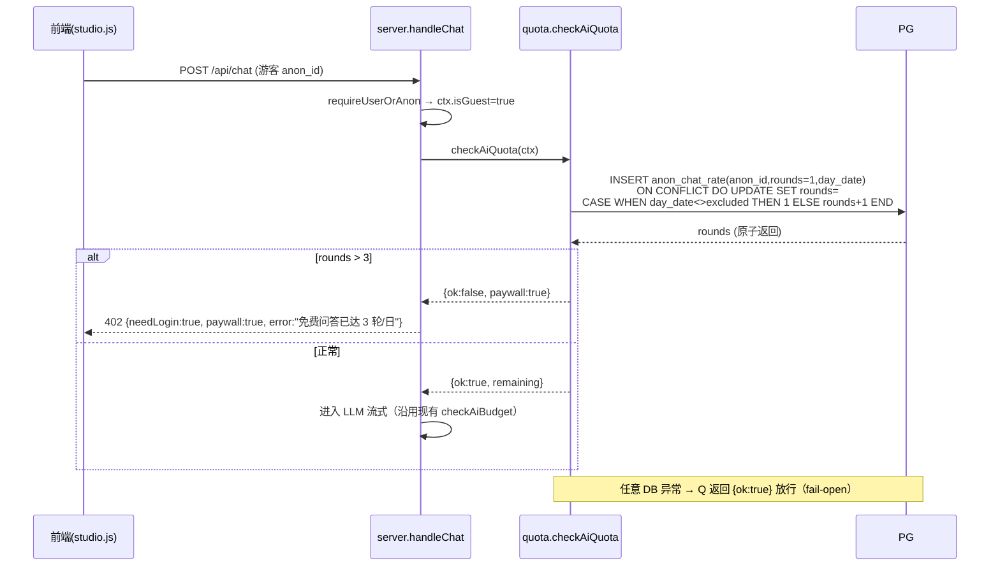
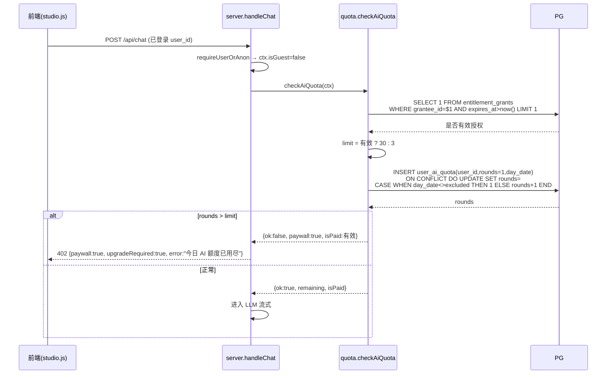
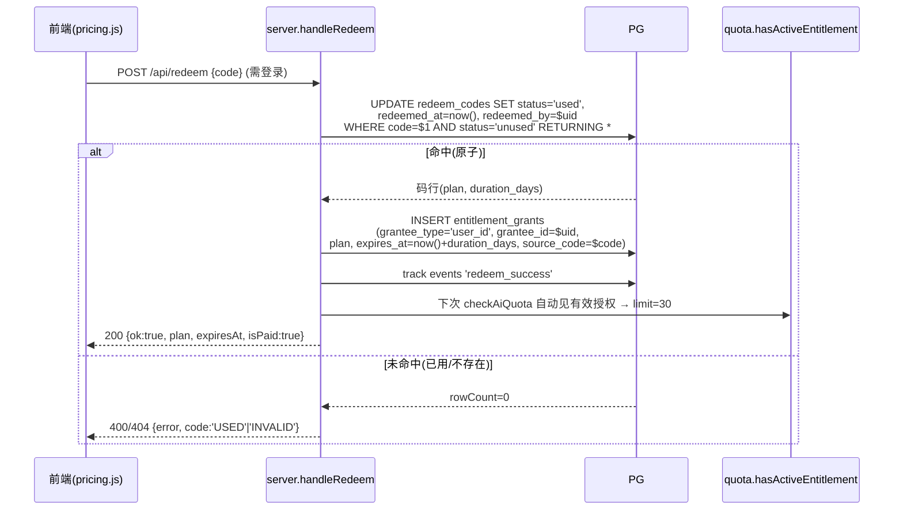

# 辰箓 I3 · 变现闭环 — 系统设计与任务分解

- 版本：v1（设计稿，待主理人评审）
- 角色：架构师 高见远
- 日期：2026-09-07
- 依据：
  - `docs/plan/RELEASE-PLAN-2026-09-07.md` §二 I3 块、§三 关键路径
  - `docs/prd-vnext-2026-09-07.md` §4 P0-6/P0-7/P0-8、§5 变现路径
  - 实读：`server.js` / `lib/db.js` / `lib/schema.sql` / `lib/auth.js` / `public/{studio,app,index,login}.js` / `tools/test-{quota,redeem,paywall}.mjs`
- 技术基线（硬约束，不可违背）：单进程 `node server.js`、原生 `http`、PG `pg.Pool`、前端零构建纯静态、**严禁任何新依赖/构建工具/框架/图形库**、所有新增服务端逻辑 **fail-open**、schema 迁移走 `lib/schema.sql` 幂等 `CREATE TABLE IF NOT EXISTS` / `ALTER TABLE ... ADD COLUMN IF NOT EXISTS`。

---

## 1. 实现方案 + 框架选型

**框架选型结论：零新依赖，沿用既有技术栈。**

- 进程：`node --experimental-strip-types server.js`（原生 http，非 Express）。
- 数据：PostgreSQL，复用 `lib/db.js` 的 `pool` 与 `query()`；新增逻辑一律走 `query()`。
- 前端：`public/` 下原生 ES + HTML + CSS，零构建；新增 `pricing.html` + `pricing.js` 纯静态页。
- 鉴权：复用现成 `ADMIN_TOKEN`（与 `/api/admin/llm` 同款校验），不新发明鉴权机制。
- 配额并发：无 Redis，采用 PG **单行 `INSERT … ON CONFLICT DO UPDATE` 原子 UPSERT** 维护每日计数，天然并发安全、零新依赖。

**P0-6 / P0-7 付费 flag 衔接方案（关键决策）：**

按关键路径 P0-6 在 P0-7 之前，但"付费用户"判定需读 `entitlement_grants`。为避免"表尚未建"的依赖风险，采用 **两表同批建** 方案：

- 在 I3 的 **同一份 schema 迁移（T01）** 中，幂等创建 `redeem_codes` 与 `entitlement_grants` 两张表（与 `user_ai_quota` 一起）。
- `lib/quota.js` 的 `hasActiveEntitlement(userId)` 在 P0-6 阶段即直接查询 `entitlement_grants`：P0-7 尚未写入任何行前，查询返回"无有效授权" → 即免费态，**不影响 P0-6 独立上线**。
- `hasActiveEntitlement` 对任何异常 **fail-open**（表不存在/查询失败 → 视为无授权、放行对话、仅按免费额度计），绝不让用户看到 500。

> 此方案同时满足 RELEASE-PLAN "或两表同批建" 的建议，把跨任务依赖收敛为"同一次迁移"，工程上最干净。

---

## 2. 文件列表及相对路径

### 2.1 新建文件

| 文件 | 作用 | 任务 |
|---|---|---|
| `tools/backup-daily.mjs` | C7 每日 `pg_dump` + 保留 7 天（读 `.env`，gzip 落 `/opt/bazi-system/backups/`） | T01 |
| `public/pricing.html` | P0-8 静态定价页（年卡主推 + 免责 + 退款 + 收款码占位） | T03 |
| `public/pricing.js` | P0-8 进页发 `pricing_viewed`；兑换码输入入口 | T03 |
| `lib/quota.js` | P0-6 配额核心：`checkAiQuota` / `hasActiveEntitlement` / 原子 UPSERT | T02 |

### 2.2 修改文件

| 文件 | 改动点 | 任务 |
|---|---|---|
| `lib/schema.sql` | `anon_chat_rate` 加 `day_date`；新增 `user_ai_quota` / `redeem_codes` / `entitlement_grants` | T01 |
| `server.js` | ① 进程内每日备份定时器（execFile `backup-daily.mjs`）② 挂载 `/api/quota`、`/api/redeem`、`/api/admin/redeem-codes`（GET/POST）③ `handleChat` 用 `checkAiQuota` 替代旧 `checkChatGuest` 仅游客限流 ④ `handleMe` 回带 `plan`/`entitlementExpiresAt` ⑤ `/api/config` 加 `aiFreeRounds`/`paidDailyRounds` ⑥ GDPR `handleExport`/`handleDelete` 纳入新两表 | T01 / T02 / T04 |
| `public/studio.js` | 登录态显示剩余 AI 轮次 + 付费徽标；额度耗尽提示"前往定价页 `/pricing.html`"；兑换成功后刷新付费态 | T02 / T04 |
| `public/index.html` | 顶部导航加"会员"链接 → `/pricing.html` | T03 |
| `public/studio.html` | 同上（导航加定价入口） | T03 |
| `public/login.html` | 同上 | T03 |
| `public/nianli.html` | 同上 | T03 |
| `tools/test-{quota,redeem,paywall}.mjs` | 已存在（skip 脚手架）；实现须对齐其断言契约（无需重写，T05 校验） | T05 |

---

## 3. 数据结构与接口

### 3.1 ER / 类图（Mermaid `classDiagram`）

```mermaid
classDiagram
    class anon_chat_rate {
        +TEXT anon_id «PK»
        +INT rounds
        +DATE day_date
    }
    class user_ai_quota {
        +BIGINT user_id «PK,FK→users»
        +INT rounds
        +DATE day_date
    }
    class redeem_codes {
        +TEXT code «PK»
        +VARCHAR status  «unused|used»
        +VARCHAR plan     «year…»
        +INT duration_days
        +TEXT created_by
        +TIMESTAMPTZ created_at
        +TIMESTAMPTZ redeemed_at
        +TEXT redeemed_by
    }
    class entitlement_grants {
        +BIGSERIAL id «PK»
        +VARCHAR grantee_type «user_id|anon_id»
        +TEXT grantee_id
        +VARCHAR plan
        +TIMESTAMPTZ granted_at
        +TIMESTAMPTZ expires_at
        +TEXT source_code «FK→redeem_codes.code»
    }
    class users {
        +BIGINT id «PK»
    }
    users ||--o| user_ai_quota : ON DELETE CASCADE
    redeem_codes ||--o{ entitlement_grants : source_code
```

**字段说明**

- `anon_chat_rate`（改后）：原 `anon_id / rounds` 无 `day_date` → 终身 3 轮硬伤。补 `day_date DATE NOT NULL DEFAULT (timezone('Asia/Shanghai', now())::date)`，与 `user_ai_quota` 对称，统一 Asia/Shanghai 自然日。
- `user_ai_quota`（新）：注册用户每日 AI 轮次配额，与 `anon_chat_rate` 并列，避免改游客表结构去兼容两类身份。
- `redeem_codes`：`status` 仅 `unused|used` 两态；`duration_days` 来自发码时设定（默认 365）；`redeemed_by` 存兑换用户 id。
- `entitlement_grants`：**付费 flag 的权威来源**。`grantee_type` 当前只用 `user_id`（游客必须登录后才能兑换，呼应"前端限制不算数"）；`expires_at` 为付费有效期终点，`hasActiveEntitlement` 判 `expires_at > now()`。

### 3.2 程序调用流（Mermaid `sequenceDiagram`）

**流 A — 游客每日 3 轮（fail-open）**



**流 B — 注册用户付费 flag 判定（免费 3 / 付费 30）**



**流 C — 兑换码原子核销（P0-7）**



---

## 4. 任务列表（有序 · 按关键路径 · 含依赖）

> 关键路径顺序（RELEASE-PLAN §三，不可颠倒）：
> `pg_dump(0.3d) → P0-6 配额(1.5d) → P0-8 定价页(1.5d) → P0-7 兑换码(2.0d) → G2(首笔付费)`
> 任务按此排列；T03（定价页）技术上与 T02 无依赖，可并行，但按关键路径排在 T02 后。

### T01 · 基础设施：每日备份(C7) + 全量 I3 Schema 迁移 【P0】
- 源文件：`tools/backup-daily.mjs`（新）、`lib/schema.sql`（改）、`server.js`（改：进程内备份定时器 + 路由挂载占位）
- 依赖：无
- 要点：
  - `tools/backup-daily.mjs`：`pg.Client` 读 `.env`（复用 `cleanup-orphans.mjs` 的 env 加载写法）；`execFile('pg_dump', ['-h',host,'-U',user,'-d',db,'-f', file])` → gzip；输出 `/opt/bazi-system/backups/YYYY-MM-DD.sql.gz`；删除 >7 天的旧档；失败 `console.error` + `process.exitCode=1`（**不阻断主进程**）。
  - `server.js`：在 `main()` 内 `setInterval(24h, ()=>execFile('node',['tools/backup-daily.mjs']))` 兜底（系统 cron 之外的双保险）；同时挂载路由：`/api/quota`(GET)、`/api/redeem`(POST)、`/api/admin/redeem-codes`(GET/POST)，处理函数由后续任务填充，未实现前返回 `501`（fail-open，不崩）。
  - DDL（幂等，见 §3.1）：`anon_chat_rate` 加 `day_date`；新建 `user_ai_quota` / `redeem_codes` / `entitlement_grants`。
  - **fail-open**：启动执行 `initSchema()` 已存在；备份定时器异常仅告警。

### T02 · P0-6 服务端权威配额（lib/quota.js + handleChat 接入 + 前端额度展示）【P0】
- 源文件：`lib/quota.js`（新）、`server.js`（改：`handleChat`/`handleQuota`/`handleMe`/`handleConfig`）、`public/studio.js`（改）
- 依赖：T01
- 要点：
  - `lib/quota.js`：
    - `checkAiQuota(ctx)`：统一入口。guest → `anon_chat_rate` 原子 UPSERT（见 §3.2 流 A）；user → 先 `hasActiveEntitlement` 定 `limit`（有效 30 / 否则 3）→ `user_ai_quota` 原子 UPSERT（流 B）。返回 `{ok, remaining, limit, isPaid}`。
    - `hasActiveEntitlement(userId)`：查 `entitlement_grants`；异常/表缺失 → `false`（fail-open）。
    - 常量：`FREE_DAILY_ROUNDS=3`、`PAID_DAILY_ROUNDS=30`（集中定义，便于运营改）。
    - **fail-open**：任何 DB 异常 → 返回 `{ok:true, remaining:FREE_DAILY_ROUNDS, isPaid:false}`（放行，绝不让用户看到 500/拦截）。
  - `server.js`：
    - `handleChat` 用 `checkAiQuota(ctx)` 替代原 `checkChatGuest`（原仅游客限 3）。超限返回 `402 {needLogin|paywall|upgradeRequired, error}`。
    - `GET /api/quota`：`requireUserOrAnon` → 返回 `{remaining, limit, isPaid, plan}`（对齐 `test-quota.mjs` 断言：`remaining`/`limit` 字段）。
    - `handleMe` 回带 `plan`（`'free'|'paid'`）、`entitlementExpiresAt`（对齐 `test-paywall.mjs`：user 对象含 `plan`）。
    - `/api/config` 加 `aiFreeRounds=3`、`paidDailyRounds=30`。
  - `public/studio.js`：登录后调 `/api/quota` 显示"今日剩 X 轮"；`plan==='paid'` 显示会员徽标；额度耗尽文案加"前往 [定价页](/pricing.html) 解锁付费额度"。

### T03 · P0-8 定价页（静态 + 导航 + 埋点）【P0】
- 源文件：`public/pricing.html`（新）、`public/pricing.js`（新）、`public/index.html` / `studio.html` / `login.html` / `nianli.html`（改：导航加"会员/定价"→ `/pricing.html`）
- 依赖：无（按关键路径在 T02 后；可与 T02 并行）
- 要点：
  - 年卡主推，单一价格用占位常量 `PLAN_PRICE_YEAR`（页面内 `const`，注释"运营待定，改此一处即可"）。
  - 显著免责声明（沿用 `DISCLAIMER_L2` 文案："文化研究与娱乐参考，不构成医疗/法律/投资建议"）+ 真实退款说明段落。
  - 收款码占位：`` + 文案"扫码付款后，凭备注/订单号联系运营获取兑换码"（个人收款码，非在线支付）。
  - `pricing.js`：进页 `track('pricing_viewed')`（I0 白名单已含）；提供"我有兑换码"输入，跳转 `POST /api/redeem`。
  - 路由：`serveStatic` 已能服务 `/pricing.html`，无需改 `server.js`（静态页零成本）。

### T04 · P0-7 兑换码 MVP（核销 + 管理端 + entitlement 接通 + GDPR）【P0】
- 源文件：`server.js`（改：`handleRedeem` / `handleAdminRedeemCodes` + GDPR `handleExport`/`handleDelete`）、`lib/quota.js`（已含 `hasActiveEntitlement`）、`public/pricing.js` / `public/studio.js`（改：兑换成功刷新付费态）
- 依赖：T01（两表已建）、T02（`hasActiveEntitlement` 已就绪）
- 要点：
  - `POST /api/redeem {code}`（`requireUserOrAnon` 且须已登录，游客拒绝）：原子核销（§3.2 流 C）→ 写 `entitlement_grants` → `track('redeem_success')` → 200。重复使用/不存在/过期 → 400/404 `code:'USED'|'INVALID'|'EXPIRED'`（对齐 `test-redeem.mjs`）。
  - `POST /api/admin/redeem-codes`（ADMIN_TOKEN 保护）：`body.codes:[{code, plan?, durationDays?}]` 批量生成；`GET` 同名路由列表。校验复用 `/api/admin/llm` 的 `body.token` / `?token=` 模式。
  - **GDPR（C6）**：`handleExport` 增加 `redeem_codes`（`redeemed_by=$uid`）、`entitlement_grants`（`grantee_id=$uid`）两组；`handleDelete` 增加 `DELETE FROM entitlement_grants WHERE grantee_id=$1`、`DELETE FROM redeem_codes WHERE redeemed_by=$1`，并在 `before` 计数中补两项（与 `test-gdpr.mjs` 双条件口径一致）。
  - **fail-open**：核销写库异常 → 返回 500（不静默授予）；但 `checkAiQuota` 读授权异常一律放行（见 T02）。

### T05 · 验收对齐 + 部署自检（QA 脚本契约 / preflight）【P1】
- 源文件：`tools/test-quota.mjs`、`tools/test-redeem.mjs`、`tools/test-paywall.mjs`（已存在，验证实现满足其断言）；`tools/preflight.mjs`（已存在，串联发布门禁 — 确认 I3 三脚本纳入）
- 依赖：T02、T04
- 要点：
  - 三脚本均为 **skip 脚手架**（功能未实现时 `SKIP` 不阻断）。本任务 = 验证 T02/T04 的实现满足其断言契约：
    - `test-paywall.mjs`：绕过前端直连 `/api/chat`，免费用户第 4 轮必须被服务端 `402/403` + `paywall` 标志（核心命题"前端限制不算数"）。
    - `test-quota.mjs`：`/api/quota` 返回 `remaining`/`limit`。
    - `test-redeem.mjs`：可用码首兑 200、重复/过期/未知码 ≥400。
  - 在 `tools/preflight.mjs` 中确认 I3 三脚本进入发布门禁串联（任一红不许发版）。

---

## 5. 依赖包列表

**空（0 个新依赖）。**

预期为 0。本设计全部用 Node 内置模块 + 现有 `pg`：
- 每日备份：`node:child_process` 的 `execFile` + 系统 `pg_dump`（生产盒已装 PG 客户端，非 Node 依赖）。
- 配额并发：`pg` 单行 `ON CONFLICT` 原子 UPSERT。
- 鉴权：现成 `ADMIN_TOKEN`。
- 前端：原生 ES + HTML + CSS。

若实现中发现必须引入任何依赖（如系统无 `pg_dump` 客户端），将显式上报主理人并触发裁剪重评（违反"引入任何新依赖即触发重评"硬线）。

---

## 6. 共享知识（跨文件约定）

1. **Asia/Shanghai 自然日（全项目唯一口径）**：一律用 PG 侧求值，禁止在前端/Node 用本地时区算日期：
   ```sql
   timezone('Asia/Shanghai', now())::date   -- 作为 day_date 默认值与会话内比较键
   ```
   不做 Node `Intl`/UTC 偏移的二次实现，避免与 PG 会话时区不一致（参考 `checkAiBudget` 已用 `date_trunc('day', now())` 的同款原则）。

2. **每日配额原子 UPSERT（ON CONFLICT 幂等，并发安全）**：
   ```sql
   INSERT INTO <tbl> (key, rounds, day_date)
   VALUES ($1, 1, timezone('Asia/Shanghai', now())::date)
   ON CONFLICT (key) DO UPDATE
     SET rounds = CASE WHEN <tbl>.day_date IS DISTINCT FROM excluded.day_date THEN 1
                      ELSE <tbl>.rounds + 1 END,
         day_date = excluded.day_date
   RETURNING rounds;
   ```
   跨日自动归 1，单条语句原子完成"判日+计次"，无竞态、无 Redis。

3. **ADMIN_TOKEN 校验封装位置**：复用 `server.js` 现有 `/api/admin/llm` 写法——`GET` 走 `?token=`，`POST` 走 `body.token`；不一致即 `401 {error:'管理员令牌错误'}`；`ADMIN_TOKEN` 空则 `403`。P0-7 管理端点直接照搬，不新写鉴权。

4. **fail-open 统一契约**：所有新增服务端函数/`try-catch` 兜底返回"放行"默认值（如 `checkAiQuota` 异常 → `{ok:true}`；`hasActiveEntitlement` 异常 → `false`），仅"明确安全硬拦截"（内容禁区 `isBlocked`、兑换码原子核实用 `WHERE status='unused'` 防重兑）才失败。埋点 `track` 失败静默忽略（现有）。

5. **GDPR 双条件口径**：导出/删除须同时覆盖 `user_id=$1` 与 `anon_id IN (SELECT anon_id FROM user_anon_link WHERE user_id=$1)`（现有六表口径）；新增 `entitlement_grants`/`redeem_codes` 按 `grantee_id`/`redeemed_by = $uid` 覆盖。

6. **配置常量集中**：免费/付费每日轮次、年卡价格占位、兑换码默认有效期，集中在 `lib/quota.js`（轮次）与 `public/pricing.js`/`pricing.html`（价格）顶部 `const`，便于运营改一处生效。

---

## 7. 待明确事项（需主理人 / Edward 拍板）

1. **年卡主推占位价格具体数字？** PRD 存在 ¥1,000 与 "30人×¥9.9" 的内部矛盾，已按"年卡单一主推"修正。页面用 `PLAN_PRICE_YEAR` 占位常量（建议先用 ¥99/年，注释清晰）；**请 Edward 拍板最终数字**（含是否展示"原价划线"）。

2. **兑换码默认有效期 `duration_days`？** PRD 未给。建议默认 `365`（与年卡等价），或 `NULL` = 永不过期。**请拍板**（影响 `redeem_codes.duration_days` 默认值与发码接口）。

3. **管理端发码：本期做 UI 还是仅 API？** 生产仅靠 Edward 手动开通，建议本期**仅 ADMIN_TOKEN 保护的 API**（`test-redeem.mjs` 已按此契约），管理页可后续补。**请确认是否需一个简单的 `admin.html` 发码区块**，以免本期范围膨胀。

4. **付费每日额度数字确认？** 免费 3 轮/日已由 D4 拍板（N=3）；付费 30 轮/日 取自 PRD P0-6a 建议。**请 Edward 确认 30 是否合适**，还是更高（如 100）/或付费即"不限轮次"（仅限每日 AI 成本护栏兜底）。此值决定 `PAID_DAILY_ROUNDS` 常量。

---

## 附：关键路径与交付门（复述，便于中转）

```
pg_dump(T01) → P0-6 配额(T02) → P0-8 定价页(T03) → P0-7 兑换码(T04) → [G2: ≥1 笔真实付费] → T05 验收
```

- **G2 唯一硬指标**：≥1 笔真实付费到账（`redeem_success` 事件可观测）。
- **代码先行、收款待备案**：收款码展示与兑换码发放可先上线，对外收款以备案下号 + https 生效为 GO 条件（运营 C3）。
- **裁剪触发**：若超预算，按 RELEASE-PLAN §五 顺序砍（P0-7 自动化 → P0-6 分层）；本设计已是最简实现，优先保留 P0-6 服务端权威配额（事实欺诈红线）。
